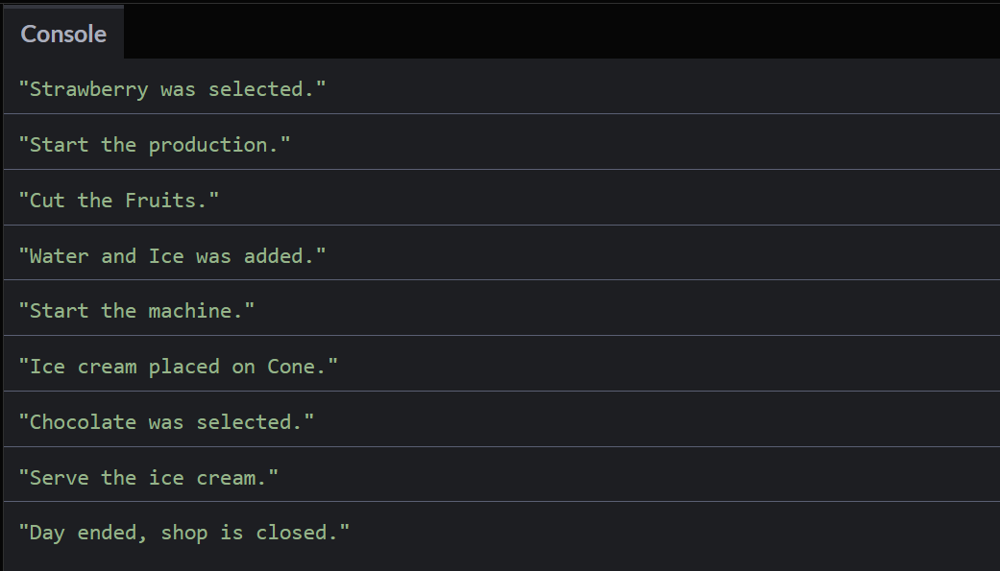
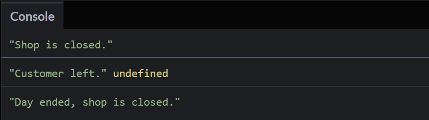

# Async/ Await #
Instead of the whole function where we initiated the promise in the last part, we can only use:

```
async function order () {}
```

and we have the promise. The `async` keyword is necessary when we want to use the keyword `await`, and the two combined enable actual asynchronous programming in Javascript. 

But we need to understand the concepts of:

- the two keywords `try` and `catch`
- how to use the `await` keyword

## `try` and `catch` ##
`try` allows us to define a block of code and test it for errors while it is being executed. 
`catch` allows us to define a block of code if an error occured in the `try` section. 
They can be used in an `async` function.

As an example have a look at the following template of how to use them:

```
async function function_name(){
  try{
	<do something>
  }
  catch(error){
    <do something>
  }
  finally{
    <do something>
  }
}
```

## `await` ##
In the ice cream example, when I go out to get the order from the customer, the kitchen is closed completely. 
During this time, the kitchen awaits the order from the customer. Everything else except the kitchen is working.

Have a look at the following code:

```
let toppings_choice = () => {
  return new Promise((resolve, reject) => {
    setTimeout(() => {
      resolve(
        console.log("Which topping would you like? ")
      )
    }, 3000)
  })
}

async function kitchen () {
  console.log(" A ")
  console.log(" B ")
  console.log(" C ")
  
  await toppings_choice()
  
  console.log(" D ")
  console.log(" E ")
}

kitchen()
```
In this case the `await` inside the function `kitchen` waits until the promise in the function `toppings_choice` is fullfilled. 
After 3 seconds, the kitchen is fullfilled and the rest of the function `kitchen` is executed. Following the console output of this code snippet:


## Final Example ##
Following the full program of the final example:

```
let stocks = {
  Fruits : ["Strawberry", "Grapes", "Banana", "Apple"],
  Liquid : ["Water", "Ice"],
  Holder : ["Cone", "Cup", "Stick"],
  Toppings : ["Chocolate", "Peanuts"],
};

let is_shop_open = false;

function time(ms){
  return new Promise((resolve, reject) => {
    if(is_shop_open){
      setTimeout(resolve, ms)
    }
    else{
      reject(console.log("Shop is closed."))
    }
  })
}

async function kitchen(){
  try{
    await time(2000)
    console.log(`${stocks.Fruits[0]} was selected.`)
    
    await time(0000)
    console.log("Start the production.")
    
    await time(2000)
    console.log("Cut the Fruits.")
    
    await time(1000)
    console.log(`${stocks.Liquid[0]} and ${stocks.Liquid[1]} was added.`)
    
    await time(1000)
    console.log("Start the machine.")
    
    await time(2000)
    console.log(`Ice cream placed on ${stocks.Holder[0]}.`)    
    
    await time(3000)
    console.log(`${stocks.Toppings[0]} was selected.`)
    
    await time(2000)
    console.log("Serve the ice cream.")
  }
  catch(error){
    console.log("Customer left.", error)
  }
  finally{
    console.log("Day ended, shop is closed.")
  }
}

kitchen();
```

In the beginning we are defining all our stock that we have, followed by the variable `is_shop_open` which indicates the state of pour shop (open or closed). 
Then we define the function `time`, which we hand over the time in milliseconds and which opens a promise everytime we call the function. 
The promise inside the function checks whether the shop is open or not, if it is open it sets a timeout, if it is closed it returns a message that the shop is closed. 
Then we define the asynchronous fucntion kitchen, where the actual process of the kitchen takes place. 
The `try` function does step by step the whole production and each step begins with awaiting the `time` function. 
The `catch` function is raised in case that the shop is closed and the time function rejected, i.e. raised an error. 
The `finally`function is raised in every case after the execution of the `kitchen` function, whether the shop was opened or closed. 
After the definition of the function `kitchen`, we call the function to actually start the process.

Following the output in case that the shop was openend:


Following the output in case that the shop was closed:
