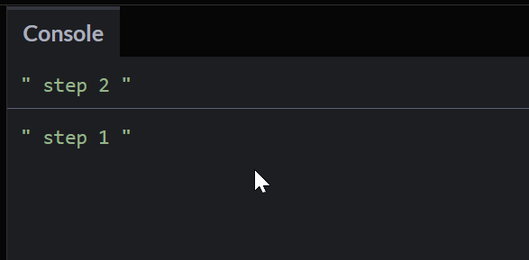
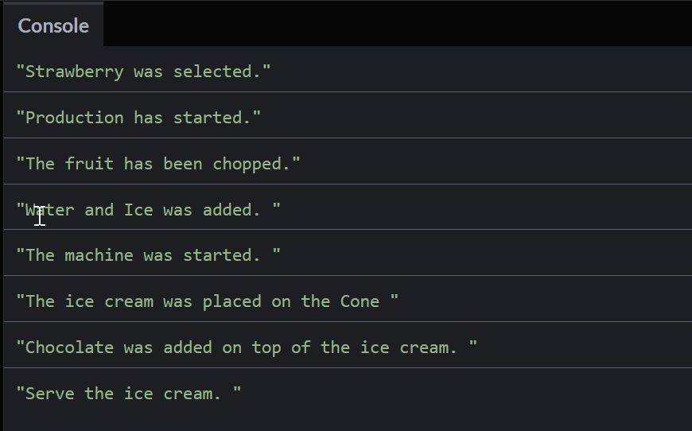

# Callback #
Callback means calling a function inside another function.

## Synchronous ##
Have a look at the follwing code snippet:

```js
function one () {
  console.log(" step 1 ")
};

function two() {
  console.log(" step 2 ")
};

one();
two();
```

Again here we have an order of how the code is executed, i.e. function `one()` is executed before function `two()`

## Asynchronous ##
Have a look at the following code snippet:

```js
function one(call_two) {
  call_two();
  console.log(" step 1 ");
}

function two() {
  console.log(" step 2 ");
}

one(two);
```

We can give a function as an argument to the other function. The handed in function can then be called inside the first function to execute it there.

The result looks like this:



## Ice Cream Example with Callback ##
We have a specific oder that we have to follow to finally serve the ice cream to the customer.

1) Get the Order from Customer
2) Fetch Ingredients
3) Start Production
4) Serve

To get back to the very first example, we are now able to show the full sequence of ice cream production by using setTimeouts and callbacks. As a reminder, here the sequence:

1. The customer makes the order (2)
2. We cut the fruit (2)
3. We add water and ice (1)
4. we start the machine (1)
5. we select the container (2)
6. we select the topics (3)
7. we serve the ice cream (2)

Have a look at the following code:

```
let stocks = {
  Fruits : ["Strawberry", "Grapes", "Banana", "Apple"],
  Liquid : ["Water", "Ice"],
  Holder : ["Cone", "Cup", "Stick"],
  Toppings : ["Chocolate", "Peanuts"],
};
```

First we define the whole stock that is needed to make ice cream

```
let order = (fruit_name, call_production) => {
  
  setTimeout(()=>{
    console.log(`${stocks.Fruits[fruit_name]} was selected.`)
    
    call_production();
    
  }, 2000)
  
};

let production = () => {
  
  setTimeout(() => {
    console.log("Production has started.");
    
    setTimeout(() => {
      console.log("The fruit has been chopped.");
      
      setTimeout(() => {
        
        console.log(`${stocks.Liquid[0]} and ${stocks.Liquid[1]} was added. `)
        
        setTimeout(() => {
          
          console.log("The machine was started. ")
          
          setTimeout(() => {
            
            console.log(`The ice cream was placed on the ${stocks.Holder[0]} `)
            
            setTimeout(() => {
              console.log(`${stocks.Toppings[0]} was added on top of the ice cream. `)
              
              setTimeout(() => {
                
                console.log("Serve the ice cream. ")
                
              }, 2000)
              
            }, 3000)
            
          }, 2000)
          
        }, 1000)
        
      }, 1000)
      
    }, 2000);
    
  }, 0000);
  
};

order(0,production);
```
Then we start the production by using the setTimeout function and callbacks. It works, the whole sequence is executed correctly:



But as we regard the code, we notice that we use many nested setTimeouts, which is also called a callback hell.

## Callback Hell ##
