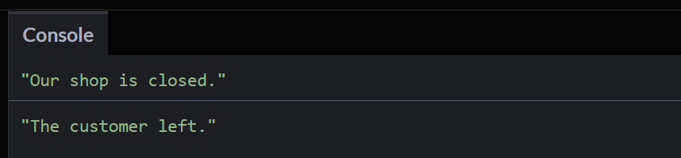
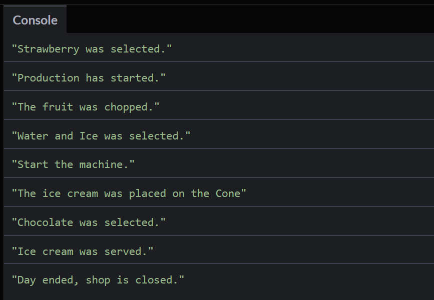
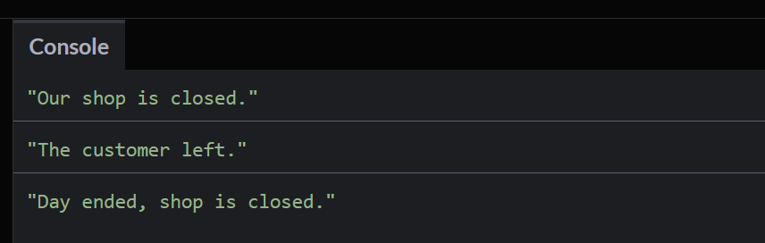

# Promises #
In order to understand promises properly, we first need to understand the promise cycle:


In the first step the promise is made. Following from this, the promise is pending. In the next step, 
there are two different ways: either the promise is resolved (the requirements for the promise are fullfilled) 
or it is rejected (the requirements for the promise are not fullfilled).

Let us first consider the case where the requirements for the promise are fullfilled. In this case we can resolve the problem and 
follow our routine to finally fulfill the promise.

In case that the requirements for the promise are not fullfilled, we need to reject the problem, send an exception 
why we could not fullfill the promise and finally close the promise.

## Ice Cream Example ¨##
Let us consider the ice cream example. We run an ice cream store. A customer enters the store and orders mango ice cream (Promise is made). 
We first need to check if we have mango ice cream im our stock (Pending). If we have mango ice cream in our stock (Resolve) we have seven 
steps to produce the ice cream (`.then`). After the production, we can serve the ice cream to the customer. If we do not have mango 
ice cream in our stock (Reject), we have to apologize to the customer and explain that we do not have mango ice cream in our stock (`.catch`). 
Once that the day of work is over, and either we have served 0 cusotmers or many customers, that does not matter, the `.finally` statement does always run.

## Additional Things to Understand ##

- Relationship between time and work: The work needs its time to fulfill the promise
- Promise chaining: the chaining of the `.then` statements, which represent the work steps
- Error Handling: `.chatch` statement when we have a reject
- The `.finally` handler: it runs independently whether we had a reject or a resolve

### Relationship between Time and Work ###
Have a look at the following code:

```
let stocks = {
  Fruits : ["Strawberry", "Grapes", "Banana", "Apple"],
  Liquid : ["Water", "Ice"],
  Holder : ["Cone", "Cup", "Stick"],
  Toppings : ["Chocolate", "Peanuts"],
};

let is_shop_open = true;

let order = (time, work) => {
  
  return new Promise( (resolve, reject) => {
    
    if(is_shop_open){
      
      setTimeout( () => {
        resolve( work() ); 
      }, time)      
    }
    
    else{
      reject(console.log("Our shop is closed."))
    }
  })
};

order(2000, ()=>console.log(`${stocks.Fruits[0]} was selected.`));
```

Again we first code the `stocks`, where we stock all our resources that we need to produce the ice cream. 
Then we define the attribute `is_shop_open`, which indicates whether our shop is opened or not.
Then we define the function order, where we actually start the order, and hand over the attributes `time` and `work`, 
whereas `time` indicates the time that the step needs and `work` indicates the actual work that is to do in this step. 
Inside the function we define the promise and hand over the two attributes `resolve` and `reject`, 
whereas `resolve` the part that is executed when the promise can be fullfilled and `reject` is the part that is 
executed when the promis cannot be fullfilled. Inside the promise we check if we can fullfill the promise, i.e. 
we check if our store is open. if it is open, we `resolve` the `work` after the needed amount of `time` by setting a timeout. 
If the store is closed, we execute the `reject` function, where we print to the console that the store is closed. 
Finally, we execute the function `order`, where we hand in 2000 (time that is needed for the first step), 
and the `work` function, here a simple console printout, which we will adjust in the following parts.

### Promise Chaining ###
The promise chaining (compared to the figure above) is the part with the many `.then`s. The `.then` function 
has the follwing format: 

```
fuction_name()
.then(()=>{
	return(0000, any_other_function_name())
})
```

Mind that after the function (here `fucntion_name`) to append an `.then` statement, there cannot be a semicolon `;` otherwise it will not work. 
The amout of spaces between the function and the `.then` does not matter.

Now have a look at the follwing code:

```
order(2000, ()=>console.log(`${stocks.Fruits[0]} was selected.`))

.then(() => {
  
  return order(0000, ()=>console.log("Production has started."));
})

.then(() => {
  
  return order(2000, ()=>console.log("The fruit was chopped."));
})

.then(() => {
  
  return order(1000, ()=>console.log(`${stocks.Liquid[0]} and ${stocks.Liquid[1]} was selected.`));
})

.then(() => {
  
  return order(1000, ()=>console.log("Start the machine."));
})

.then(() => {
  
  return order(2000, ()=>console.log(`The ice cream was placed on the ${stocks.Holder[0]}`));
})

.then(() => {
  
  return order(3000, ()=>console.log(`${stocks.Toppings[0]} was selected.`));
})

.then(() => {
  
  return order(1000, ()=>console.log("Ice cream was served."));
})
```

Out of the former production chain with the callback hell, we created a clean code by using only `.then` statements.

### Error Handling ###
But we are not done yet. What we have done so far is the left side of the promise cycle (when the promise is fullfilled). 
But now we still have to handle the behaviour of the program when a promise canno be fullfilled (in our case when our store is closed).

Herefore we use the `.catch` statement with the follwoing template (after the last `.then` statement)

```
.catch(() => {
	<Do what to do in case of an error.>
}
```

So we implemtent the behaviour of our production line in case that the promise cannot be fullfilled:

```
.catch(() => {
  console.log("The customer left.");
})
```

In the beginning we implemented the attribute `is_shop_open` and set it to true. Now we set it to `false`.

In this case, the if-statement in the `order` function goes to the `else` part and with this part it calls the `.catch` fucntion.



### The `.finally` Handler ###
The `.finally` handler is situated at the end of the promise chain and is executed in every case. 
It is placed at the end of the promise chain and has the following template:

```
.finally(() => {
  <Do something final>
})
```

So we implement it into our example as follows:

```
.finally(() => {
  console.log("Day ended, shop is closed.")
})
```

So for the case that the shop is open it looks as folllows:



And in the case that the shop is closed it looks as follwos:


