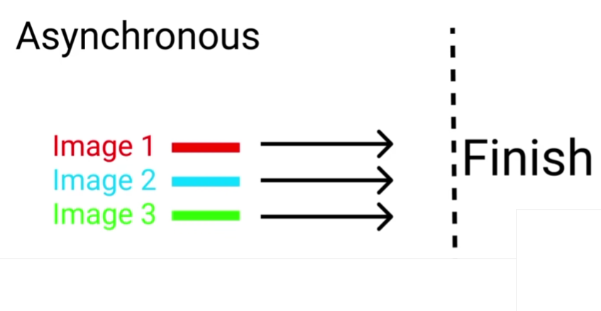

# Synchronous vs. Asynchronous #

## Synchronous ##
A good example is an old website, where each picture is loaded afer another. When you had additionally slow internet or a bad connection, 
then you were able to observe loading each picture one by one. To illustrate this, have a look at the following image:


If any process stops, then the whole process stops too.

Example:
Javascript runs code from the top to the bottom, so if we run the following code:

```
console.log(" I ")

console.log(" eat ")

console.log(" icecream ")

console.log(" with a ")

console.log(" spoon ")
```

We get the following result:


So we see that if one process gets stuck, all the follwoing processes get stuck, too.

## Asynchronous ##
In an asychronous website, the pictures load together. To illustrate this, have a look ath the following image.



If any process stops, the whole system is not affected from that stop.

Example:
By using the built-in and aysnchronous function `setTimeout()` this allows us to run a function after a specific amount of time. 
This function takes as the first input the error function. 
As the second input, it takes the time (in milliseconds) that the timeout should last. 
With this function, we can delay the execution of a function for a desired amount of time. 
So, have a loot at the following code snippet

```
console.log(" I ");

console.log(" eat ");

setTimeout(() => {
  console.log(" ice cream ");
}, 4000);

console.log(" with a ");

console.log(" spoon ");
```

The normal `console.log()`s are printed directly to the console, but the one in the `setTimeout()` function is stopped for 4 seconds until it is printed to the console.

