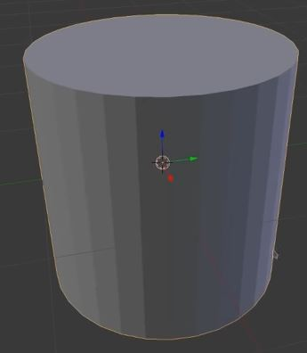
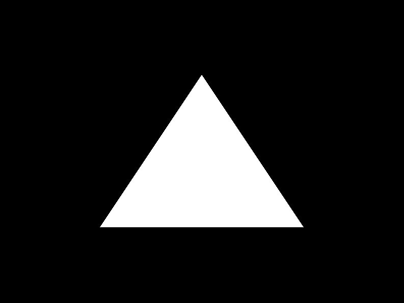

# Introduction
The graphics card can draw surfaces only in triangles, since between three points it is always possible to draw a flat surface. When more than four points are used, it becomes possible to draw invalid surfaces, which must be avoided. But how can curves be drawn? This is not possible. Instead, the surface of a curved object can be drawn by using multiple segments of flat surfaces. As an example we have the cylinder below where it becomes visible how the "curved" surface is made. By increasing the number of flat surfaces, the cylinder looks more and more curved. By smoothing the surface, the cylinder looks liked it is curved.



## [OpenGL Rendering Pipeline](https://www.khronos.org/opengl/wiki/Rendering_Pipeline_Overview)


### Vertex Specification
We give the vertices as an input in form of an array. These vertices represent traingles and the graphics card shall display these triangles in a further step.

### Vertex Shader
Small programs which run on the graphics card. New programs can be implemented. The vertex shader is executed for every vertex which is given in the vertex specification.

### Tesselation & Geometry Shader
These two points are optional and belong to advanced OpenGL use.

#### Vertex Post-Processing
Clipping, calling etc., i.e. OpenGl checks if the vertex is visible on the screen. If is not, OpenGL will ignore it.

### Primitive Assembly
Makes triangles using the vertices which were specified.

### Rasterization
Makes pixels using the triangles which were made in the primitive assembly.

### Fragment Shader ~= Pixel Shader
The pixels in our defined interval are executed. All the other pixels outside the interval are not considered. It is displayed as optional but in most cases the fragment shader is used.

### Per Sample Operations
Multisample etc.

## Drawing a first triangle with the old Pipeline

Between the commands `glBegin(GL_Traingle)` and `glEnd()` we can define our vertices by using `glVertex2f(xxf, xxf);` for a two-dimensional vertex and where the intervals of the x and y coordinates is [-1.0f, 1.0f].

```cpp
while (!close) {
	glClearColor(0.0f, 0.0f, 0.0f, 1.0f);
	glClear(GL_COLOR_BUFFER_BIT);

	// Using the old pipeline
	glBegin(GL_TRIANGLES);		// Starts drawing
	// Here inbetween we can draw our triangle
	glVertex2f(-0.5f, -0.5f);	// 2D
	glVertex2f(0.0f, 0.5f);
	glVertex2f(0.5f, -0.5f);
	glEnd();			// Ends drawing
	
	// Frame Buffer (show something in the window, otherwise it's empty)
	SDL_GL_SwapWindow(window);

	SDL_Event event;
	while (SDL_PollEvent(&event)) {
		if (event.type == SDL_QUIT) {
			close = true;
		}
	}
}
 ```
This draws the following triangle:


