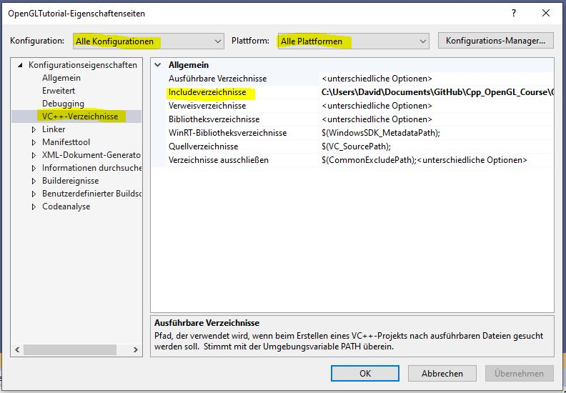
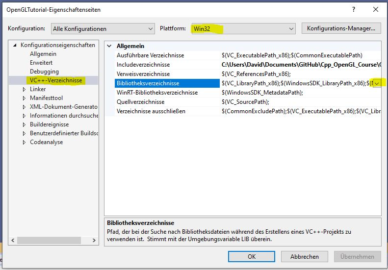
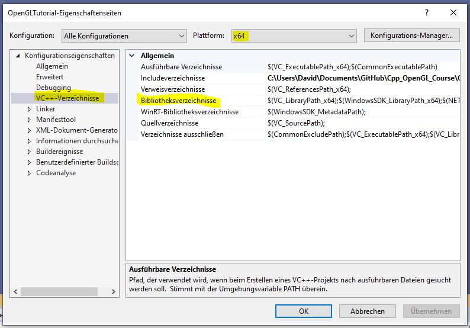
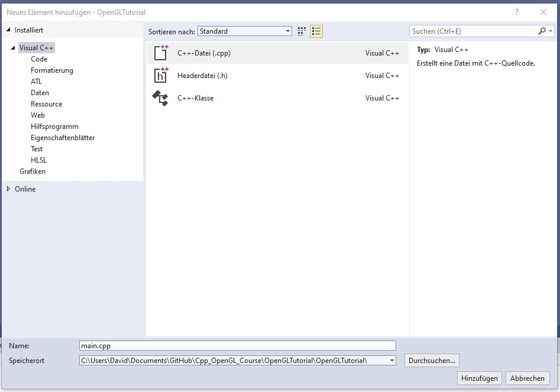

# Setting up a new project in Visual Studio:
Choose empty C++ Project

## Including dependencies
Right Click on Project -> Open Folder in File Explorer -> navigate one path up -> create new folder named "Dependencies" -> include the unpacked libraries SDL and GLEW

### Adjust include directories
Project -> Properties



- Configuration: All Configurations
- Platform: All Platforms
- VC++ Directories (at the left)
- Include Directories: Edit -> Folder Symbol -> ... (on folder line) -> one path up -> Dependencies-Glew-include, Dependencies-SDL-include -> OK -> Apply

### Adjust library directories (32 bit)
Project -> Properties




- Configuration: All Configurations
- Platform: Win32
- VC++ Directories (at the left)
- Library Directories: Edit -> Folder Symbol -> ... (on folder line) -> one path up -> Dependencies-Glew-lib-Release-Win32, Dependencies-SDL-lib-x86 -> OK -> Apply

### Adjust library directories (64 bit)
Project -> Properties



- Configuration: All Configurations
- Platform: x64
- VC++ Directories (at the left)
- Library Directories: Edit -> Folder Symbol -> ... (on folder line) -> one path up -> Dependencies-Glew-lib-Release-x64, Dependencies-SDL-lib-x64 -> OK -> Apply

## Create first file
Right Click on Source files -> Add -> New Item



Insert the following code into the file

```cpp
#include <iostream>
#define GLEW_STATIC
#include <glew.h>
#define SDL_MAIN_HANDLED
#include <SDL.h>

#pragma comment(lib, "SDL2.lib")
#pragma comment(lib, "glew32s.lib")
#pragma comment(lib, "opengl32.lib")

int main(int arg, char** argv) {
	std::cout << "Hello World!" << std::endl;

	std::cin.get();

	return 0;
}
```

For further information watch the [Second Video](https://www.youtube.com/watch?v=hPNmnhme4Pg&list=PLStQc0GqppuWBDuNWnkQ8rzmyx35AINyt&index=2).
