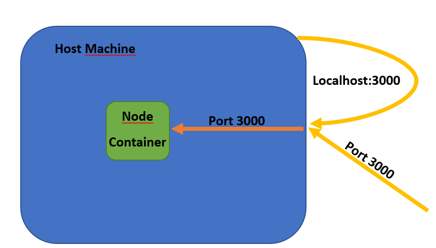

# Setup #

- IDE: [VS Code](https://code.visualstudio.com/download)
- NodeJS: Open Terminal in the folder you want to work and enter `npm init -y`
- Express: Enter `npm install express` into termial

## Index.js file ##

- In the working directory, create a new file called `index.js`.
- Import Express
- Initiate app on port 3000

## Docker Container ##

- Install Docker [Docker for Windows](https://docs.docker.com/desktop/install/windows-install/) and follow the steps until you are signed in.

## Docker Image ##

The Docker Image creates layers of the application to run.

```
FROM node:15
WORKDIR /app
COPY package.json .
RUN npm install
COPY . ./
EXPOSE 3000
CMD ["node", "index.js"]
```

- Layer 1: Node.js Version 15
- Layer 2: Workin Directory: app
- Layer 3: Copy package.json
- Layer 4: Run the command "npm install"
- Layer 5: Copy the rest of the project (to make sure that when changes were made, they were only made in the "self-written" code and not in the dependencies)
- Layer 6: Expose 3000 means listen to Port 3000 (as declared in the application)
- Layer 7: Declare the command how to run the project ("node index.js" in this case)

To build the Docker Image, type `docker build -t node-app-image .` into the terminal. Not that the part `-t node-app-image` is only there for giving a name to the docker image. It would also run by typing `docker build .`, but then the image would not have a name.

## Docker Container ##

To run the Docker Image, type `docker run -p 3000:3000 -d --name node-app node-app-image`, which runs the Docker Container on port 3000, in detached mode and gives it the name "node-app".



In the image above you can see the explanation why there is the need to write `-p 3000:3000`. When either I want to access to the node container or another machine within the same network, they access to the host machine (the machine where the application is running on) by using the indicated port (here port 3000). The host machine then accesses to the node container by using the indicated port (in the application, here port 3000). The ports can be different than 3000.

## .dockerignore ##
