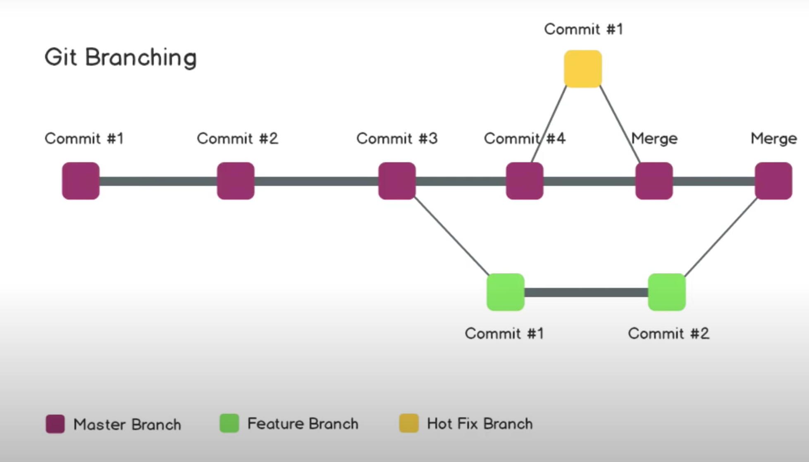

At the moment we have only been to the master branch. The master branch is the naming convention for the main branch.  When we have multiple branches, it looks more like a tree. When we make another branch, first the code on both branches (master and new one) will be exactly the same. But as we make changes on the new branch, the code starts to differ. The chages in one branch cannot be seen in the other brach. 

When we have a working and stable version on the side branch, we can merge it into the master branch. This can be very helpful when there are many people working on the same project. For example when we have a major bug inside our program, we can make another branch to fix this bug while the others can still continue their work on the master branch. An example for branching can be seen in the following image:

- `git branch` to check the different brnaches we have (the brnach with the * next to it means that we are currently in this branch)
- `git checkout -b <name of the branch>` used to create a new branch (changes automatically to that branch)
- `git checkout <name of the branch>` change the current branch to this branch
- `git diff` shows me what changes have been made bewtween the two branches
- `git push -u origin <new branch>` pushing the changes on the new branch
- pull request (pr): a request to have our code pulled into a new branch.
- open the pr register in your repository on GitHub website
- under pr we can have a look to all the changes that were made
- there comments about a specific line of code can be made
- then the merge can be made there (Button "Merge pull requests")
- after the merge and going back to the master branch, we can see that the merge was successful
- but the merge has only been made on the GitHub website, so to get up to date we need to make a `git pull` on our local machine on the master branch
- if a branch is not needed anymore, we can delete it by using the command `git branch -d <branch name>`

## Merge Conflicts ##
- Happen when multiple people work on the same file and commit their changes
- this requires manual handling of the conflicts
- if a commit on the same file has already been done in the past, we can use the command `git commit -am "message"` with `-am` meaning "add"
- when we change from on branch to another and we have done changes on the first branch, we get an error that tells us that we have local changes that would be overwritten when we change, so we have the two options `commit` or `stash`
- `stash` put the changes aside for later commit
- We do a `commit` in this case. Now we are able to checkout
- To merge on the terminal we use the command `git merge <branch name>`
- Conflict: changes have been done on two different branches
- in modern code editors we can just go to the place where the conflict is and delete the ccode snippet that we do not want to keep, buthis has to be done manually, afterwards we require a `commit`

## Undoing in Git ##
- When we accidentally add something that we did not want to add
- after adding, we can still use `git reset` or `git reset <file name>`
- Undoing a commit? `git reset HEAD~1` tells Git to undo the last commit that was made
- There is no easy way to undo to undo a specific commit that was made long ago, we need to go back all commits back to that one commit, with loosing all commits that are done afterwards. To see what we have done we can use `git log`, which shows us all the commits that we have done in reverse chronologic order.
- We can go back to a certain commit by using the unique hash that git gives to every commit `git reset <hash>`
- To delete all the commits that have been done after a certain commit we can use `git reset --hard <hash>`

## Forking ##
- In the Git interface on GitHub we can find the function "forking"
- If we want to make a pr against a repo where we do not have any access to it and make changes that we do not want to share, we can fork it
- At the top right side we can find the "fork" button
- Pressing on the button, we can choose where we want to fork the repo at
- After forking we have it in the repo where we wanted to fork the repo at
- Here we can do changes and commit them
- It is possible to create a pr to add the changes to the original repo