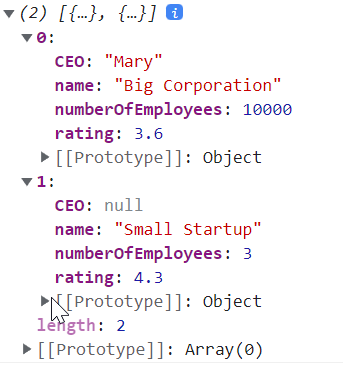

Crash Course that I worked through to get a repetition for JSON. I used this [video](https://www.youtube.com/watch?v=GpOO5iKzOmY) to complete the course.

## JSON ##

JavaScript Object Notation
- Data representation format
- Commonly used for API and Configs
- Lightweight and Easy to Read/ Write
- Integrates easily with most languages

## JSON Types ##
- Strings: "Hello World" "Dave" "I"
- Numbers: 10 1.5 -30 1.2e10
- Booleans: true false
- null
- Arrays: `[1, 2, 3]` `["Hello", "World"]`
- Objects `{"key": "value"}`, `{"age": 30}`

## Use JSON inside a File ##
A JSON file has attributes. Every attribute needs a key and a value. If there is more than one attirbute, then the attributes must be separated with a comma, but make sure that the last attribute is not followed by a comma. It looks as follows:

```
{
	"key": "value",
	"key": "value"
}
```

Example: We want to set up a JSON file called "user.json". 

```
{
	"name": "Mike",
	"favoriteNumber": "14",
	"isProgrammer": "true",
	"hobbies": ["Skydiving", "Colleting Train Posters"],
	"friends": [{
		"name": "Lionel",
		"favoriteNumber": "10",
		"isProgrammer": "false",
		"hobbies": ["football"],
		"friends": [...]
	}]
}
```

In the `friends` array we can see that JSON supports also deeply nested attributes.

## Example ##
Opening VS Code,  in the file "companies.json" we define a JSON file with some content. If we did something wrong, we get an error of VS Code. Then we setup a "index.html" file and print the JSON file to the console. The outcome is as follows:



With  the command `JSON.parse`, we turn make the JSON object usable in Javascript.

## Conclusions ##
JSON is:
- easy to read
- lightweight
- straight forward