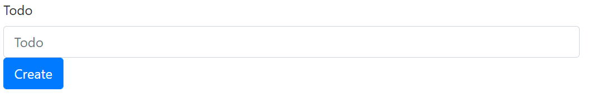

# Creating the `index.html` file #
To start, we use the  [Bootstrap startercode](https://getbootstrap.com/docs/4.3/getting-started/introduction/) that gives us a starting layout of the index.html site. 
As the form we use the [Bootstrap Form-group](https://getbootstrap.com/docs/4.3/components/forms/#form-groups). 
For the unordered list we use the template [Bootstrap Unordered List](https://getbootstrap.com/docs/4.3/components/list-group/#basic-example).

The initial `index.html` file shows a creation box and a create button.



Further, we add a script to the index file. This scritpt contains different fucntions:

## `buildIDS` ##
```
const buildIDS = (todo)=>{
	return {
		editID : "edit_" + todo._id,
		deleteID : "delete_" + todo._id,
		listItemID : "listItem_" + todo._id,
		todoID : "todo_" + todo._id
	}
}
```

This function hands over the operation followed by the object on which the operation should be executed.

## `buildTemplate` ##
```
const buildTemplate = (todo,ids)=>{
	return `<li class="list-group-item" id="${ids.listItemID}">
			<div class="row">
			<div class="col-md-4" id="${ids.todoID}">${todo.todo}</div>
			<div class="col-md-4"></div>
			<div class="col-md-4 text-right">
				<button type="button" class="btn btn-secondary" id="${ids.editID}">Edit</button>
				<button type="button" class="btn btn-danger" id="${ids.deleteID}">Delete</button>
			</div>
		</div>
	</li>`;
}
```

This function builds the layout of how the objects (contained in the DB) are shown on the index site.

## `displayTodos` ##
This function displays all the elements contained in the DB.