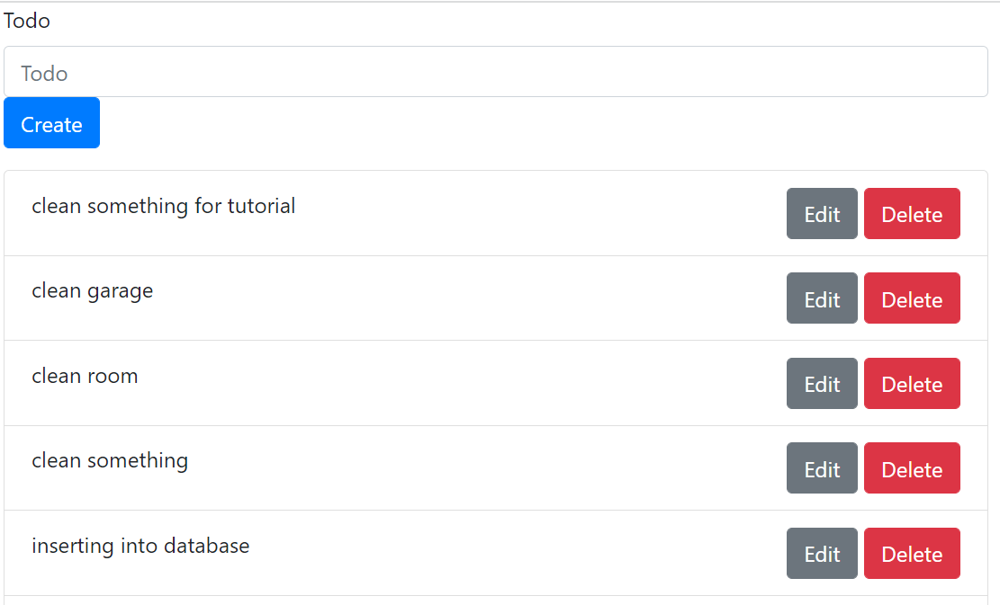

# Fetch API: GET Request #
In the `index.html` file we insert the follwoing code snippet:

```
const getTodos = ()=>{
	fetch('/getTodos',{method : "get"}).then((response)=>{
		return response.json();
	}).then((data)=>{
		console.log(data);
		displayTodos(data);
	);
}

getTodos();
```

This method makes calls the URL followed by `/getTodos`. Then it conducts a GET request, where it should receive a JSON object. 
The received data is printed to the console and handed over to the `displayTodos()` function we wrote before.


