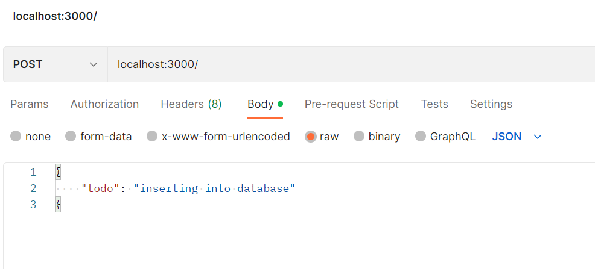

# Server Side Create Portion #
In this part we create a function that is able to insert new objects into the DB by using a client (Postman in this case).
Therefore we insert the following code snippet:

```js
// Create
app.post('/',(req,res)=>{
    // Document to be inserted
    const userInput = req.body;
        
    db.getDB().collection(collection).insertOne(userInput,(err,result)=>{
        if(err){
            console.log(err);
        }
        else
            res.json(result);
    });   
});
```
First, we define the user input, which is a JSON object. Then we insert it into the DB, if there occurs an error then we print this error to the console, 
else we put the json object into the DB.

As mentioned, we use Postman as the client. There we create a POST request as follows:




We defined that the URL for a post request is `localhost:3000/`. Additionally we send a JSON object (make sure that this is chosen).