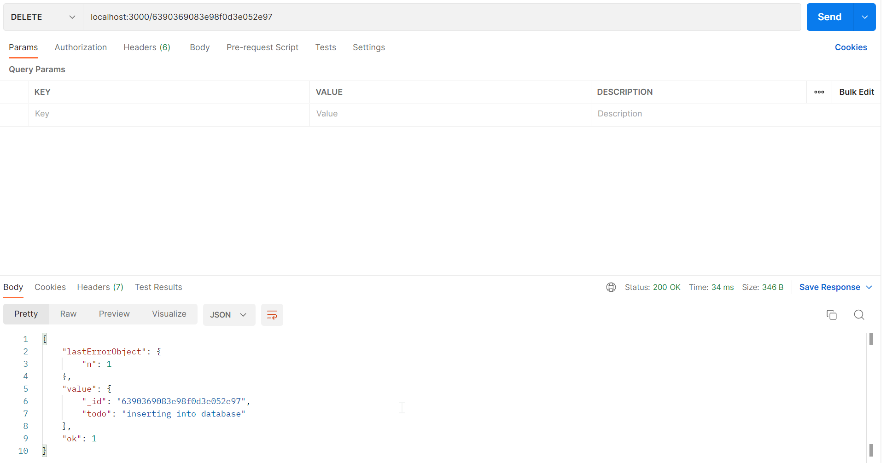

# Server Side Delete Portion #
We are going to create a delete function for the MongoDB in the server. Therefore we insert the following function into the database:

```js
app.delete('/:id',(req,res)=>{
    const todoID = req.params.id;
    db.getDB().collection(collection).findOneAndDelete({_id : db.getPrimaryKey(todoID)},(err,result)=>{
        if(err)
            console.log(err);
        else
            res.json(result);
    });
});
```

We first define the url, which is `/` followed by the object ID of the object to be deleted. 
Then, inside the function we define the `todoID`, which is sent by the client. Finally we search in the DB 
if there is an object with this ID. If not we raise an error, if yes we delete it.

## Testing the Function with Postman ##
In postman, we create a DELETE request, that uses the URL `localhost:3000/<objectID>`. There is nothing more to send, thus, it should look as follows:



Here we have an example of how it should look like. At the botom, we see the body of the response of the server. 
`n = 1`means that the counter of deleted objects has been raised to 1, then the actual object with its content is shown
and finally `"ok": 1"` means that the deletion has been successful.