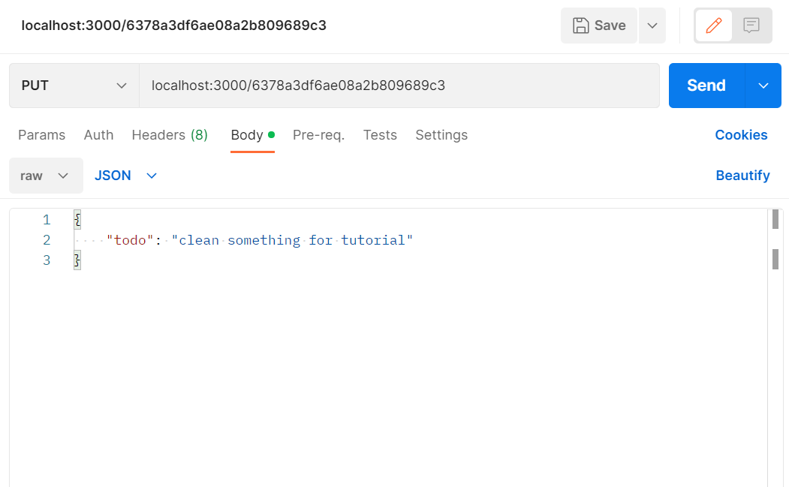
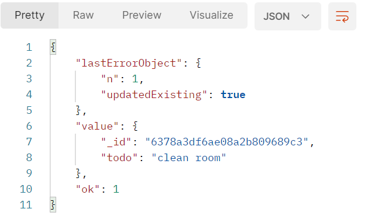

# Server Side Update Portion #
To update one of the objects (documents) in our DB, we add the following function to our application:

```js
// update
app.put('/:id',(req,res)=>{
    // Primary Key of Todo Document we wish to update
    const todoID = req.params.id;
    // Document used to update
    const userInput = req.body;
    // Find Document By ID and Update
    db.getDB().collection(collection).findOneAndUpdate(
        {_id : db.getPrimaryKey(todoID)},
        {$set : {todo : userInput.todo}},
        {returnOriginal : false},
        (err,result)=>{
        if(err)
            console.log(err);
        else{
            res.json(result);
        }      
    });
});
```

First we define the primary key of the document, the ID, and the user input. Then, we search the object in the DB by using the ID.
If the object is in the DB, update it by replacing the old document by the new one. If the object is not in the DB, send an error message.

## Using Postman ##
Getting the id for the PUT request:
At the moment, we use the PUT request to replace one of the already created objects (documents) in the MongoDB. Therefore to get the ID for the put request, just get the object in the DB that you want to replace.
Then, add the ID to the URL. It should look as follows:

```
localhost:3000/<MongoDB ID>
```

In Postman, choose a PUT request, insert the URL mentioned above, and insert the new object in JSON-format. 
Make sure that you chose JSON format explicitly! It should look as follows:



After hitting the "send" button, you should receive a similar result like the following:



It says that the number of objects updated is 1 (`"n": 1`), follwed by the object updated.