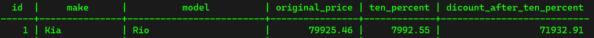

## Adding New Table and Data using Mockaroo ##
With Mockaroo, we create a new table called "car.sql" which has the following columns:

- `id`: BIGSERIAL NOT NULL PRIMARY KEY, identification number like in "person"
- `make`: VARCHAR(100) NOT NULL, name of the producer of the car
- `model`: VARCHAR(100) NOT NULL, name of the model of the car
- `price`: NUMERIC(19, 2) NOT NULL, the price of the car (between 10000 and 100000)

We insert this table into the database.

## Calculating Min, Max & Average ##
If we want to select the most expensive car in this table we can use the following command:

```sql
SELECT MAX(price) FROM car;
```

If we want to select the least expensive car in this table instead, we can use the following command:

```sql
SELECT MIN(price) FROM car;
```

To get the average of the price of all the cars in this table, we can use the command:

```sql
SELECT AVG(price) FROM car;
```

To get the rounded average price of all the cars in this table, we can use the following command:

```sql
SELECT ROUND(AVG(price)) FROM car;
```

To get the minimum or the maximum car price for each make (each producer), we can us the following command:

```sql
SELECT make, model, MIN(price) FROM car GROUP BY make, model;
SELECT make, model, MAX(price) FROM car GROUP BY make, model;
```

## SUM ##
The sum operator allows us to perform addition on our dataset. If we want to compute the sum of the prices of all the cars in the table, we can use the command:

```sql
SELECT SUM(price) FROM car;
```

If we want to compute the sum of the price of every model of a make (producer), we can use the following command:

```sql
SELECT make, SUM(price) FROM car GROUP BY make;
```

## Basics of Arithmetic Operators ##
These operators allow us to perform maths behind numbers. Basically, we can use our datasets to produce statistics or any kind of result we need. For example, if we want to find the price of a product and then we compute the discounted price of it. But first we need to learn the basics. Have a look at the following command:

```sql
SELECT 10 + 2;
```

Then we recieve the following result:


We can also perform subtraction:

```sql
SELECT 10 - 2;
```

or multiplication:

```sql
SELECT 10 * 8;
```

We can chain our computation:

```sql
SELECT 10 + 2 * 8;
```

We can perform division:

```sql
SELECT 10 / 2;
```

the power of a number:

```sql
SELECT 10^3;
```

the factorial:

```sql
SELECT 5!;
```

and finally the modulo:

```sql
SELECT 10 % 3;
```

## Arithmetic Operators - Round ##
If we wan to select every single car from the car table and we want to offer a discount of 10% to the price of each car:

```sql
SELECT id, make, model, price, ROUND(price * 0.1, 2), ROUND(price - (price * 0.1), 2) FROM car;
```

## Alias ##
If we have a look at the result of the previous section, we see that the column names of the two computed columns (10% of the price and price minus the discount of 10%) have the name "round", which is apparently not right:


This is because by default, prostgres uses the actual function as a column name if we do not specify any column name. To provide this problem, we can use the `AS` keyword:

```sql
SELECT id, make, model, price AS original_price, ROUND(price * 0.1, 2) AS ten_percent, ROUND(price - (price * 0.1), 2) AS dicount_after_ten_percent FROM car;
```

We get the following aliases:


