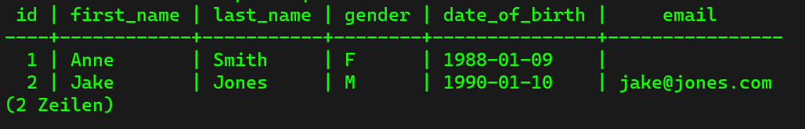
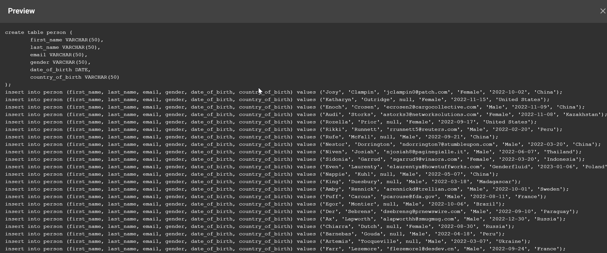

## How to Create a Database ##
First of all, to get help, just type the command `help` into the terminal. Then, there are the most important commands listed. With `\?` we can get even more help.  To get a list of all the databases that we created yet, type in the command `\l`. 

To create a new database, we have to enter the command `CREATE DATABASE test;`. It does not matter if we use uppercase or lower case, but in order to know which commands are SQL-specific or not, the preferred way is to use upper case letters for the SQL commands. Also, make sure that the commands are finished with a semicolon `;`, otherwise the commands will not be executed.

As soon as we entered the command `CREATE DATABASE test;`, the next line shows the answer `CREATE DATABASE`, which means that the database has been created successfully. By checking the list of all databases with `\l`, we see that the test database was created:


## Connect to Database ##
The command to connect to the database is `\c test`, and we are conneted to the database. If we want then to connect to antother database, we have to enter `\c <name of the other database>`, and psql switches to the database.

## A very Dangerous Command ##
To delete a database, use the command `DROP DATABASE <database name>;`. But this is a very dangerous command. Let us imagine that we have a database that has several years of history. If we now delete the database, all its content is deleted forever and there is no way to get that data back. So if we want to delete the database we must be absolutely sure that we want to delete it. In any case we must make sure that we access rights to this functionality such that only people with the respective rights have access to it. Another possibility is to have a backup of the databse. 

## How to Create Tables ##
Have a look at the following command:

```
CREATE TABLE table_name {
	Column name + data type + constraints if any
}
```

First we have to hand in the `CREATE TABLE` command followed by the table name. Inside the curly bracktes we add the columns, where we have to define the table name, the data type and the constraints if there are any.

```sql
CREATE TABLE person ()
	id INT,
	first_name VARCHAR(50),
	last_name VARCHAR(50),
	gender VARCHAR(7),
	date_of_birth TIMESTAMP,
)
```

`VARCHAR` means we can have a string with the maximum length of 50 characters. This ist the [list](https://www.postgresql.org/docs/current/datatype.html) with all the data types that are supported in Postgres. 

## Creating Tables without Constraints ##
Connect to the databse. To create the first table, we need to enter the command like we defined it above:

```sql
CREATE TABLE person ()
	id INT,
	first_name VARCHAR(50),
	last_name VARCHAR(50),
	gender VARCHAR(7),
	date_of_birth TIMESTAMP,
)
```

During entering the command into the command line, make sure not to use tabs. Further, as soon as the parenthesis is openend, we can press enter for a new line. As soon as we write the closed parenthesis, we can add a semicolon and sql terminal will recognize this as the end of the command.

We can check which tables we have already entered by entering `\d` which will make a list of all the tables contained in the databse. There we should find the newly inserted table "person". With the command `\d person` we can find only the table "person" with all its columns and constraints.


## Creating Tables with Constraints ##
To influence the behaviour of a user, we can insert so called constraints, which must be satisfied, otherwise the data cannot be inserted. In the table that we inserted in the previous section, the user can insert a person without any data, all the columns could be null. To improve that we can specify the contraints.

An insertion of a table with constraints by using the example table "person" would look as follows:

```sql
CREATE TABLE person (
	id BIGSERIAL NOT NULL PRIMARY KEY,
	first_name VARCHAR(50) NOT NULL,
	last_name VARCHAR(50) NOT NULL,
	gender VARCHAR(5) NOT NULL,
	date_of_birth DATE NOT NULL
)
```

We improved the insertion with:
- `BIGSERIAL` -> numbers that are incremented by themselves, so we do not have to implement an id incement each time a person was inserted into the table
- `NOT NULL` -> means that the attribute cannot be inserted empty
- `PRIMARY KEY` -> this attribute identifies the person uniquley (usually an ID)

So we drop the table that we inserted in the last section by using the command `DROP TABLE person;`. Then we insert the new table person with all the constaints. Now by checking the tables by entering `\d`, we notiice that there are two new tables:


The reason why we have two tables now ist because of the `BIGSERIAL` that we defined for the attribute `id`. `BIGSERIAL` is an auto increment number, and as we can see in the column `Typ`, we see that it is not a new table, but only a sequence.

Checking the table by entering `\d person` shows us the whole new table:


So as we can see, the attributes were inserted with all the contraints that we defined.

## Insert Into ##
So far we have the database called `test`, with one table called `person` that has the following attributes:
- `id`
- `first_name`
- `last_name`
- `gender`
- `date_of_birth`
- `email`

Now we want to insert the data of a new person into that table:
- 1
- Anne
- Smith
- FEMALE
- 09/01/88

To insert this data, we have to enter the follwing command:

```sql
INSERT INTO person (
	first_name,
	last_name,
	gender,
	date_of_birth)
VALUES ('Anne', 'Smith', 'FEMALE', DATE '1988-01-09');
```

First we need to tell into wich table we want to insert the data, then we have to specify the columns where we actually want to insert the data and finally we have to hand in the values that we want to insert. The values match the data types of the attributes of the table. So in this case `[String, String, String, Date]`. Have a look at the special treatment of the date. Remember that we do not have to hand in a email address since this column is no mandatory.

Now we want to insert a second person into the table, this time with a email address:

```sql
INSERT INTO person (
	first_name,
	last_name,
	gender,
	date_of_birth,
	email)
VALUES ('Jake', 'Jones', 'MALE', DATE '1990-01-10', 'jake@jones.com');
```

As we have seen, we did not specify the id of both persons. This is because the type `BIGSERIAL` does an auto increment for us.

With the command `SELECT * FROM person;` we can have a look at how the table looks like now that we have inserted the first two entries:



## Generate 1000 Lines with Mockaroo ##
In this part we are going to insert 1000 more persons into the table. Further we are going to insert another column called "Country of Birth". Since 1000 persons more would be very time consiming to insert them manually, we are going to use [Mockaroo](https://mockaroo.com/), which is a data generator, where we can define every attribute that we have in our table and choose how many entries that we want to have. Then, Mockarooo creates a SQL file. Following a short preview.



To open this SQL file, we use VS Code. Here we can see the content of the whole file. Each line already contains the insert command that is needed to insert the data into the database. But insteat of copying all the lines and simply paste them into the terminal, we use a smarter way. 

First we delete the table person, since we do not want the old entries in our database and moreover we do not have the column "country_of_birth" implemented yet. Since we are going to learn more about changing cells in a table later, it makes sense to delet it.

Then we use the following command

```
\i `<path to the person.sql file>`
```

In Winsows, make sure that you use the quotation marks and that the path starts with `C:/`.

Now we have inserted the data into the database. With the following command we can now display what we have inserted into the databse:

```sql
SELECT * FROM person;
```

We notice that we have all the data inserted, but we missed the id of the person. Therefore we head back to VS Code and insert:

```sql
id BIGSERIAL NOT NULL PRIMARY KEY,
```

Additionally, since we see that the attribute gender sometimes has in the list created by Mockaroo a length longer than 7, so we increase the `VARCHAR` length to 20.