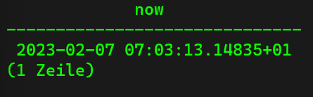

## Timestamps and Dates ##
Often when we store data in our tables, we also use timestamps, for example to verify when this record was created or updated or for birthday dates etc. There is one funtion that gives us the actual date:

```sql
SELECT NOW();
```

This gives us the actual timestamp:



If we want only the date or only the time, we can use the following commands:

```sql
SELECT NOW()::DATE;
SELECT NOW()::TIME;
```

There is more to find about timestamps in the [PostgreSQL Documentation](https://www.postgresql.org/docs/current/datatype-datetime.html).

## Adding and Subtracting with Dates ##
If I want to subtract one year from now, I can use the following command:

```sql
SELECT NOW() - INTERVAL '1 YEAR';
```

We can also subtract months from now:

```sql
SELECT NOW() - INTERVAL '10 MONTHS';
```

Or days:

```sql
SELECT NOW() - INTERVAL '10 DAYS';
```

We can also add time:

```sql
SELECT NOW + INTERVAL '10 DAYS';
SELECT NOW + INTERVAL '10 MONTHS';
SELECT NOW + INTERVAL '10 YEARS';
```

If we simply want to have the date:, we can ust the follwoing command:

```sql
SELECT (NOW() + INTERVAL '10 MONTHS')::DATE;
```

## Extracting Fields ##
This function allows us to extract specific values from a date. For example we want to extract the year, month, day, day of the week. or century from now, we can use the following command:

```sql
SELECT EXTRACT(YEAR FROM NOW());
SELECT EXTRACT(MONTH FROM NOW());
SELECT EXTRACT(DAY FROM NOW());
SELECT EXTRACT(DOW FROM NOW());
SELECT EXTRACT(CENTURY FROM NOW());
```

## Age Function ##
If we want to have an addidional column with the actual age of all the people in our table "person", we can use the following command:

```sql
SELECT first_name, last_name, gender, country_of_birth, date_of_birth, AGE(NOW(), date_of_birth) AS age FROM person;
```
