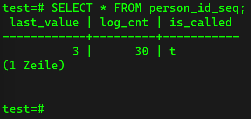
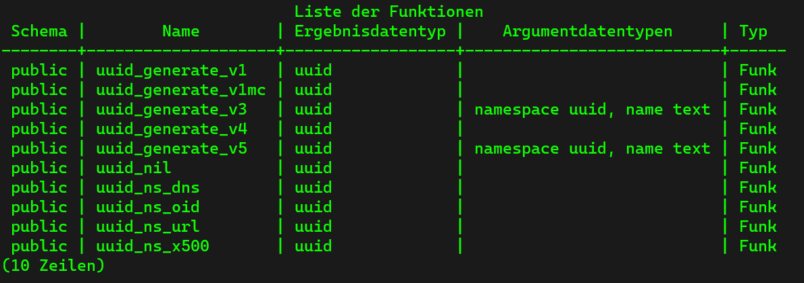
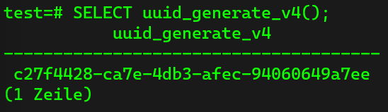

# Further Knowledge #

## Exporting Query Results to CSV ##
In this part we are going to learn how we can generate a CSV file using postgres. Therefore we have to be aware of the following two steps:

1. Selection of the data
2. Exporting the slection to a CSV file

The follwoing command can be used:

```sql
\copy (SELECT * FROM person LEFT JOIN car ON car.id = person.car_id) TO '<Output destination in file storage> + <filename>.csv' DELIMITER ',' CSV HEADER;
```

- Make sure that you give the file a name
- The `DELIMITER` keyword is used to indicate how the data shall be stored in the CSV file
- THE `CSV HEADER` keyword indicates that the headers should be attached to the file

## Serial & Sequences ##
In this part we are going to learn about the `BIGSERIAL` type. `BIGSERIAL` is a special data type which auto-increments a number (Integer). Checking the ids in both of the tables (person and car), we see that both ids have not the type `BIGSERIAL`, but the type `BIGINT`. Having a look at the column "Default", we see that there is the following code snippet:

```sql
nextval('person_id_seq'::regclass)
nextval('car_id_seq'::regclass)
```

This means that those two values are managed by a sequence. Using the following command:

```SQL
SELECT * FROM person_id_seq;
```

shows the following result:



The `last_value` is 3, since we have 3 entries in the table, the `log_count` is the number how many times that the table was invoekd, and `is_called` affects the behavior of `nextval`. If we would just use the following code command:

```sql
SELECT nextval('car_id_seq'::regclass);
```

In this case we would get 4. Since we now invoked the `nextval`, the next person that we would insert into the table would have the id of 5. This makes it possible that we can restart our sequence at a demanded value, by using the following command:

```sql
ALTER SEQUENCE person_id_seq RESTART WITH 10;
```

## Extensions ##
Basicall, extensions are simply functions that can add extra functionality to the database. To see the list of all available extensions in PostgreSQL, we can simply use the command:

```sql
SELECT * FROM pg_a:
```

For example `plv8` allows us to add Javascript functions to PostgreSQL. `uuid-ossp` allows us to generate unverally unique identifiers.

## Understanding UUID Data Type ##
UUIDs (universally unique identifiers) allow us to have a guaranteed unique identifier, whenever the identifier is generated. In addition, this identifier is globally unique. Read [here](https://en.wikipedia.org/wiki/Universally_unique_identifier) more about UUIDs.

To use UUIDs in postgres, we first have to install the extension:

```sql
CREATE EXTENSION IF NOT EXISTS "uuid-ossp";
```

The keyword `IF NOT EXISTS` makes sure that if the extension already exists that it is not installed twice. In this why we can run the command as much as we want, but the extension is only installed once, so it is a so called idempotent command.

In order to generate a UUID, we have to invoke the extension. Therefore we use the following command:

```sql
\df
```

With this command, we get the list of all the new functions:



The function that we want is version 4, which is completely random:

```sql
SELECT uuid_generate_v4();
```

This generates a unique UUID every time we invoke it:



The fact that the UUIDs are globally unique, means that we can create UUIDs without having conflicts with other databases. If we would use the types `INT` or  `BIGINT`, then mot likely we would have clashes between the ids of the two databases. 

## UUID As Primary Key ##
To change the primary key in both, person and car, we change the id in both of the tables to:

```sql
person_uuid UUID NOT NULL PRIMARY KEY,
car_uuid UUID NOT NULL PRIMARY KEY,
```

We have to change the foreign key in car as wlll. Therefore we change it as follows:

```sql
car_uuid UUID REFERENCES car(car_uuid),
```

Then we have to adjust the actual inserts:

```sql
person_uuid
```

and the value:

```sql
uuid_generate_v4()
```

This has to be done for each insert, also for the table `car`. Finally, we have to drop the two tables, insert them with the new uuids, create the contraints and finally we have inserted UUIDs to the table.
