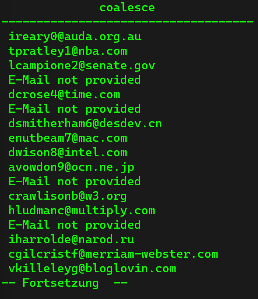

# Handling of Null Values #

## Coalescence ##
The `COALESCE` keyword is used to handle nulls. It allows us to have a default value in case the first one is not present. If we hand in an array of values and there are many null values into it, `COALESCE` gives us backt the very first value that is not null. So let us have a look at the following commands

```sql
SELECT COALESCE(null, 1);
SELECT COALESCE(null, null, 1);
SELECT COALESCE(null, 1, 10);
```

each of those queries gives "1" as the output. So from the table person we want to have all the e-mail addresses, but we know that there are some persons who do not have an e-mail address. So we want to replace each empty e-mail cell with a placeholder, like "E-mail not provided". Have a look at the following command:

```sql
SELECT COALESCE(email, 'E-Mail not provided') FROM person;
```

With this command, we receive the following result:



## Nullif ##
In this part we cover how we can tackle the division by zero. Similar like in many other programming languages, PostgreSQL prevents from divisions by zero with exceptions. `NULLIF` takes two agruments and returns the first argument if the second argument is not equal to the first one.

```sql
SELECT NULLIF(10, 10);
SELECT NULLIF(10, 1);
```

For the first command above we receive null, for the second one we receive 10. But if we use the command:

```sql
SELECT 10 / NULL;
```

PostrgreSQL does not raise an exception. So instead we use:

```sql
SELECT 10 / NULLIF(2, 0);
```

Then we receive 5 as the result. 
