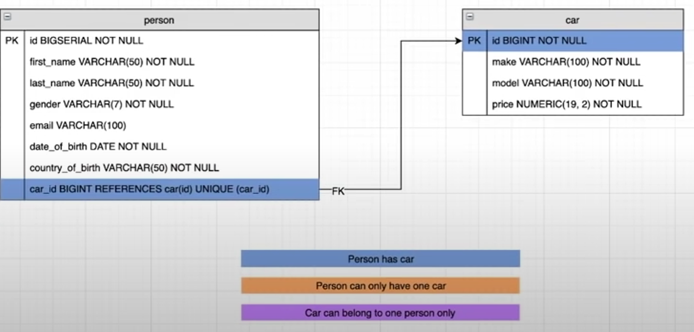
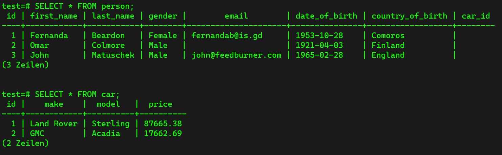
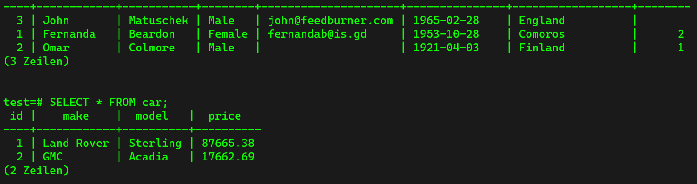
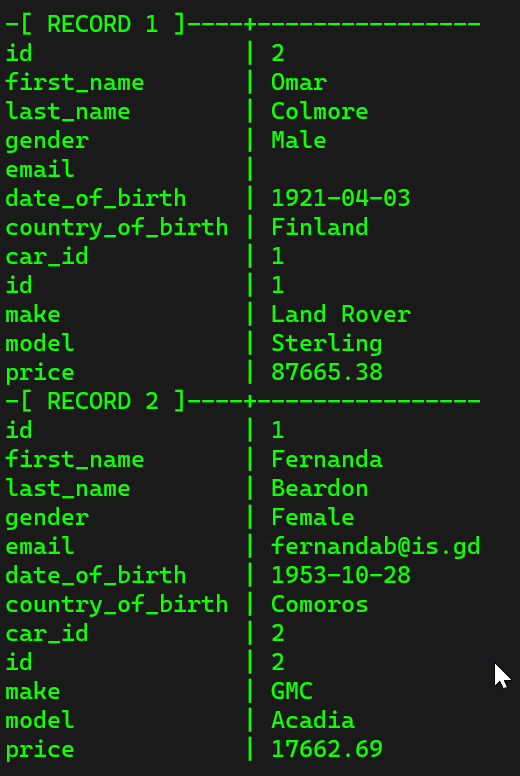
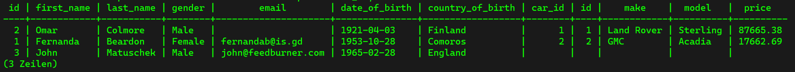

## Foreign Keys, Joins & Relationships ##
Until now, we have two different tables: person and car. Now we want to have a query that returns a combination of both the tables for a single person, i.e. a query where we select the person as well as the car. The naïve approach for this is to have a table where we have all the information of a single person, but in this way we would have huge tables. Since PostgreSQL is relational, we can have many single tables that can be connected to each others using "Foreign Keys". Therefore we need to have constraints:

* a person has a car
* a person can only have one car
* a car can only belong to one person

So we have a relationship:



In the last row of the table person we can see the attribute car, this is the actual foreign key. A foreign key is a column that references a primary key in another table. This link is displayed by the arrow between `car_id` in the table person and the `id` in the table car. In order to this to work, the types have to be the same. They syntax is as follows:

```sql
car_id BIGINT REFERENCES car(id) UNIQUE (car_id);
```

The `UNIQUE` keyword makes sure that only one car can belong to one person. 

## Adding Relationships between Tables ##
In this part we are going to add a relationship between the two tables. The contraints are described in the former chapter. Therefore we are going to remove the two tables and recreate it from scratch.

We insert the two tables again. But before we have to adjust the attributes of the table "person" and create the relations between the two tables. So into the table "person", we insert the following line:

```sql
car_id BIGINT REFERENCES car (id)
```

This line creates the reference to the table car. `BIGINT` is pretty much the same as `BIGSERIAL`, but with the difference that `BIGINT` does not increase. We do not insert the `NOT NULL` constaint, sicne a person can have a car, but does not have to. Also, we have to add another line: 

```sql
UNIQUE(car_id)
```

This line introduces the unique contraint into the table, which means that one car can only belong to one person.

But now if we would insert the table person first, this would fail, since we are going to describe a relation to a table that does not exist yet. Therefore we insert the table "car" first, since we do not have a relation in it, so we insert the table "car" first. Finally, we end up with the tow following tables:



## Updating Foreign Keys Columns ##
If we now want to assign two cars to two people, we can use the follwing commands:

```sql
UPDATE person SET car_id = 2 WHERE id = 1;
```

This means that we are going to assign the car with `id = 2` to the person with the `id = 1`. If we now want to assign this car to another person, this will not work because of the `UNIQUE` constraint.

Then we do the following assignment:

```sql
UPDATE person SET car_id = 1 WHERE id = 2;
```

If we now check the two tables, we can see that the relations were done successfully:



## Inner Joins ##
No that we have the foreign key for a relation between two tables (A and B), we can learn about joins. An inner join is a good way to combine two tables. The inner join takes whatever is common in both of the tables. So if we have a record inside of the table A and also inside of the table B, so if we have a foriegn key which is present in both of the tables, then the inner join gives us the result that is present in both of the tables (C).


To perform an inner join for our two tables "person" and " car", we can use the following command:

```sql
SELECT * FROM person 
JOIN car 
ON person.car_id = car.id;
```

To see the results better, we can use the follwing command (use the same command to undo the selection):

```sql
\x
```

And we receive the following results:



Now we can see the entire information of both of the tables. We can also only grab single columns from the join:

```sql
SELECT person.first_name, car.make, car.model, car.price 
FROM person 
JOIN car ON person.car_id = car.id;
```

## Left Join ##
Left Joins allow us to combine two tables like inner joins, (table A and table B) with the difference that the left join additionally gives us the whole content of the left table (i.e. table A), as well as the records of table B that have correspondance with table A (like the inner join). This means that all the records of table A are given, even if there is no match.


If we want to perform a left join on our example table, we can us the following command:

```sql
SELECT * FROM person LEFT JOIN car ON car.id = person.car_id;
```

Then we receive the following result:



With this command, we can now also look for peobple who do not have a car, using the following command:

```sql
SELECT * FROM person LEFT JOIN car ON car.id = person.car_id WHERE person.car_id IS NULL;
```

or as well (same command, just that we are checking if all the columns of "car" are empty):

```sql
SELECT * FROM person LEFT JOIN car ON car.id = person.car_id WHERE car.* IS NULL;
```

## Deleting Records with Foreign Keys ##
If we have a relation between two records in two different tables, it becomes impossible to simply delete them.  Because of the foreign key constraint, it is not simply possible to delete such a record. So if we want to delete a record that contains a relation to another table, we first need to remove the constraint to be able to delete the record.  We have two options:

- delete the record that is related to the record to be deleted (if it has no relation to another table)
- update the relation attribute in the record to be deleted to null

There is another method to delete records that have relations to other records, called Cascade. Cascade removes every record that has to be deleted without paying attention to relations. But this is bad practise, since we always want to have the control about what data is deleted.