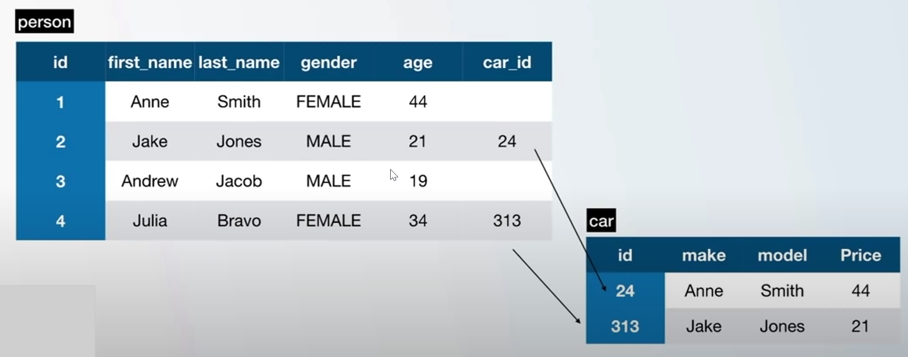

PostgreSQL has its own query language.

## What is a Database? ##
A databse is a place where we can stor, manipulate and retrieve data. This data is often stored in a computer server. 

## PostgreSQL and Relational Database ##
SQL is the short form for Structured Query Language, which is a programming language. This language allows us to interact with databases. It allows us to have commands as follows:

```
SELECT frist_name FROM person
```

SQL allows us to manage data held in a relational database and it is very easy to learn, but at the same time it is very powerful. It is very widely used all over the internet. 

But how is the data actually stored? The answer is: in tables. The tables are formed by columns and rows. As an example we have the table for a person:

| id | first_name | last_name | gender | age |
| :-- | :----------| :-----------| :-------- | :---- |
| 1 | Anne | Smith | FEMALE | 44 |
| 2 | Jake | Jones | MALE | 21 |

The columns stand for single attributes of the person and the rows stand for the actual person. 

A relational table is simply a relation between one or more tables. 



As we can see in the figure above, a person may or may not have a car, and the relation between the table person and the table car is the car id. The idea behind relational databses is that we do not want to have huge tables that store everything, instead we create realtions between smaller tables and then we set the information together by different queries.

## What is PostgreSQL? ##
PostgreSQL is the most advanced database on the market at the moment. It is very popular because it is open source and constantly evolving since 30 years.

PostreSQL is:
- Object-relational database management system
- Modern
- Open Source

## GUI Clients vs. Terminal/CMS Clients##
Now that we have up and running, we need a way to to it. Our computer is serving as a computer server, i.e. a database server, where basically everyone can connect to it, create and edit contents and use all the functionality provided by the database. 

Different way to connect to the database:
- GUI Client: Application that eases the way that we connect to the database, it makes interaction easier and we can have an insight into the data (e.g. DataGrip, pgAdmin)
- Terminal/ CMD: This is how we get the "hands dirty" since we have to perform all the interaction with the actual commands that are used for the interaction.
- Appliation: Program that we write by ourselves for actual use of the database (for client projects etc.)

## Set Up with PSQL ##

### Terminal ###
1. Open the SQL terminal
2. Since we are testing the things locally, we will connect to our local server -> press enter
3. `Database [postgres]` appears -> press enter
4. Default Port is 5432 -> press enter
5. Default username is `[postgres]` -> press enter
6. Enter the password that was created during the installation -> press enter
7. Now we are connected

### GUI ###
1. Open pgAdmin
2. On the left side, open Servers, there you see "PostgreSQL <version>", click on it
3. Enter the password
4. Now we are connected to the database
