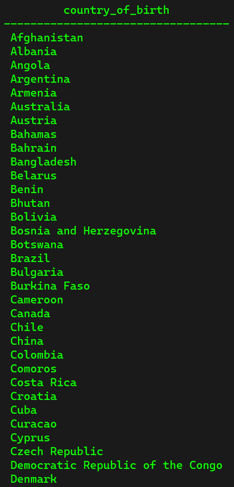
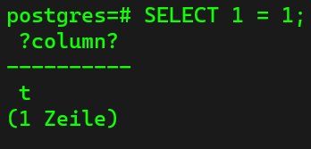

## Select From ##
We already encountered the following command:

```sql
SELECT * FROM person;
```

The `*` means that we want to select everything from the table. If we just enter `SELECT FROM person;` we would receive the number of rows that we have in this table.

If we want only to select one column of the table, we can use:

```sql
SELECT first_name FROM person;
```

or if we want two columns, we can use:

```sql
SELECT frist_name, last_name FROM person;
```

If we select rows that have no entry, such as the column "email" that may or may not have an entry, then the line that has no entry is blank.

## Order By ##
In the following section, we are going to learn the keywords:
- ascending `ASC`: If ordered ascending, this means that the smallest number or letter is listed first (like: 1 2 3 4 5, or a b c d e)
- descending `DESC`: If ordered descending, this means that the biggest number or letter is listed first (like: 5 4 3 2 1, or: e d c b a)

```sql
SELECT * FROM person ORDER BY country_of_birth;
SELECT * FROM person ORDER BY country_of_birth DESC;
SELECT * FROM person ORDER BY country_of_birth ASC;
```

By default, the first command at the top, the list is sorted ascending. If we have columns like email that may or may not have an entry, the lines with no entries will be shown first. We can also sort over more than one column. 

```sql
SELECT * FROM person ORDER BY country_of_birth, email;
```

## Distinct ##
`DISTINCT` is used to select unique values from a column. If we have a look at our example table "person" and select the ordered country column, we can see that we have several entries in this column that have the same "country_of_birth". If we want to see each country once, we can use the following command:

```sql
SELECT DISTINCT country_of_birth FROM person ORDER BY country_of_birth;
```

The result looks as follows:




## Where Clause and AND ##
The `WHERE` clause allows us to filter our data based on conditions. For example, if we want to search for example all the entries in the table that have the gender "Female",  we can use the following command:

```sql
SELECT * FROM person WHERE gender = 'Female';
```

If we want to filter for more than one condition, we can use the `AND` operator, which would look as follows:

```sql
SELECT * FROM person WHERE gender = 'Female' AND country_of_birth = 'Poland';
```

We can also use the `OR` operator if we want to diversify our selection:

```sql
SELECT * FROM person WHERE gender = 'Female' AND country_of_birth = 'Poland' OR country_of_birth = 'China';
```

## Comparison Operators ##
Operators allow us to do:
- arithmetic operations
- comparisons (`=`, `>`, `>=`, `<`, `<=`, `<>`)
- bitwise operations
- logical operations

So if we use the following comparison operation:

```sql
SELECT 1 = 1;
```

We receive the follwing result:



This comparison means that we are comparing if 1 = 1. Since this is true, postgres answers with t (true). In general, comparison operations return true or false. In this example, we used numbers, but these comparisons can applied to many other types of data.

## Limit, Offset & Fetch ##
Let us assume that we only want to select the first 10 entries of the table. Then we can use:

```sql
SELECT * FROM person LIMIT 10;
```

The `LIMIT` statement tells PostgreSQL to only select the first 10 entries of the table.

With the `OFFSET` statement we can say how many entries we want to skip from the start, so we use the following comment to skip the first 10 entries of the table:

```sql
SELECT * FROM person OFFSET 10;
```

There is also another keyword that performs the same operations like `LIMIT` which is called `FETCH`, which is the official definition. So instead of the `LIMIT` command we can also use:

```sql
SELECT * FROM person FETCH FIRST 10 ROW ONLY;
```

and we recieve the same result.

## In ##
Let us assume that we want to select every person from Switzerland, France and Italy out of our table. Then we could write the command:

```sql
SELECT * FROM person WHERE country_of_birth = 'Switzerland' OR country_of_birth = 'France' OR country_of_birth = 'Italy';
```

But this is a lot of code and we are duplicating a lot of it. Instad we can use the `IN` keyword:

```sql
SELECT * FROM person WHERE country_of_birth IN ('Switzerland', 'France', 'Italy');
```

This makes it easy to select even more countries.

## Between ##
The `BETWEEN` keyword is used to select data inside of a range. Let us assume that out of our table we want to select everyone that was born between 2000 and 2015. Then we can use the following command:

```sql
SELECT * FROM person WHERE date_of_birth BETWEEN DATE '2000-01-01' AND '2015-01-01';
```

## Like and iLike ##
The `LIKE` keyword is used to match text values against a pattern using wildcards. So if we want to find every single email address that ends in ".com", we can use the follwoing command:

```sql
SELECT * FROM person WHERE email LIKE '%.com';
```

The wildcard here is the `%` sign, which means that everything can be in the string before this sign, as long as it ends with this sequence. 

Let us assume we want to find a sequence that is inside of a string. Here we can use:

```sql
SELECT * FROM person WHERE email LIKE '%google%';
```

If we want the wildcard to have a certain length, we can use the `_`:

```sql
SELECT * FROM person WHERE email LIKE '________@%';
```

If for example we are not sure if a word is written with a capital letter or not, instead of trying to make a query with two different conditions (`LIKE p% OR P%`), we can use the keyword `ILIKE`. This keyword simply igonores uppercase or lowercase:

```sql
SELECT * FROM person WHERE country_of_birth ILIKE 'p%';
```

## Group By ##
This keyword allows us to group data based on a column. Let us assume that we want to group our data based on how many people that we have for each country that we have. Therefore we can use the following command:

```sql
SELECT country_of_birth, COUNT(*) FROM person GROUP BY country_of_birth ORDER BY country_of_birth;
```

This kind of command is very powerful for using statistics.

## Group By Having ##
This keyword allows us to perform an extra filtering after we perform the aggregation. For example when we want to select all the countries that have at least five people. This can be done with the `BY HAVING` keyword:

```sql
SELECT country_of_birth, COUNT(*) FROM person GROUP BY country_of_birth HAVING COUNT(*) > 5 ORDER BY country_of_birth;
```