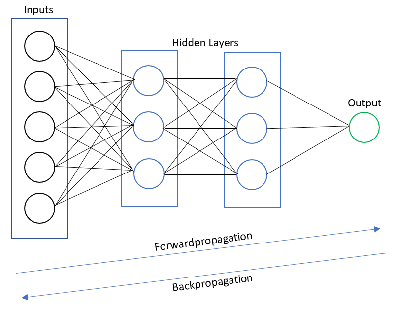
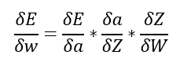

# Backpropagation #
The algorithm that is used on one training set in order to calculate the weights of the relations between the nodes. Have a look at the following figure:

The natural way (from input to output) is called the Forwardpropagation, accordingly is the the reverse way called Backpropagation.
The Backpropagation takes the output incormation and calculates backwards to get the error on certain weights. The error is a composition function of all the 
activation functions of the hidden layers before the output. The formula for the backpropagation of one output node is as follows:

- dE: Derivation of the error
- dw: Derivation one weights
- da: Derivation of the activation function
- dZ: Derivation of the sum of the inputs