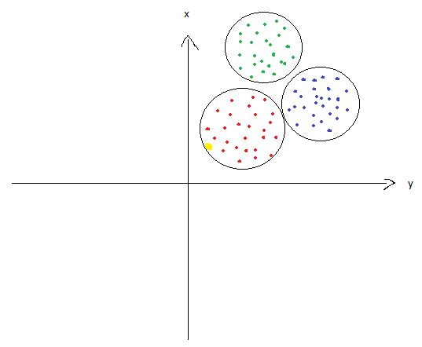

# Classification

The machine learning model uses features and those features are assotiated with labels. Classification is a way where it finds features which have some kind of similarity and which are associated with a label. Any other feature that resembles that feature will be calssified with the same label.

## Example
Let's assume we have two features and three labels. The fact that we have two features makes the data points two-dimensional with the first feature on the x-coordinate and the second coordinate on the y-coordinate. In the picture below the different colors display the three different labels.

Depending on the algorithm, classification fins a way to separate the data points into the different labels (circles around the data points in the image). If we now insert another, new point (displayed yellow in the image, the classification is now able to classify the data point and assings it the respective label (red in this case).

**Important**: Depending on the model the classification will find different ways to label the data points.
