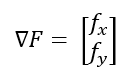

# Cost Function and Gradient Descent #

## Cost Function ##
Following a figure of the Cost Function (or also Loss Function):

This is a sketch of how a neural network could look like. There is a lot of input, there are hidden layers and the output. All the nodes are connected to each other.
The way a neural network is trained is by adjusting the weights and biases between the nodes. The cost funtion of a neural network tells the neural network how poor it performed .
The neural network then produces output over and over again, while it is trying to minimize the cost. The commonly used cost function is the mean squared error function:

y_heat is the predicted output and y is the actual output. So we subtract the predicted output from the actual output and square it. This error needs to be minimized.
Normally we have more than one output, which means that we sum up all the error of every single output and take the average of it, as follows:

The goal here is to minimize the cost by adjusting the weights and biases of every single connection between the nodes.

## Gradient Descent ##
The Gradient Descent (or Gradient Function) is the the way that neural networks use to minimize the cost function. This way the model can be trained over the time and optimize its accuracy.
The gradient function is as usual:

The Gradient Function of the Cost Function is as follows:

After computing the Gradient Function of the Cost Function, we receive a vector. The following vector is an example:

To minimize the cost, we need to change the first and the second weight towards 0, the third weight is already ok, so w leave it as it is. 
Additionally, changing the second weight will have the bigger impact on the model than changing the first one, since 0.5 > 0.3.