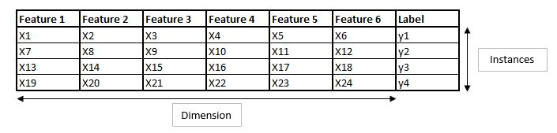

# Features and Labels

Let's have a look at the following image:

We have six features and one label. 

## Features
The features are independent variables, which means that one feature does not impact the other one. They act as an input to our machine learning model such that we can determine the correct label or the correct output. The number of features is also known as the domension. For the features we use a capitol X.

## Labels
The labels are dependent variables, so they depend on the feature and they are the output or the outcome of our model. The number of rows is also known as the number of instances. In our case we have four instances. For the labels we use a lower case y.
