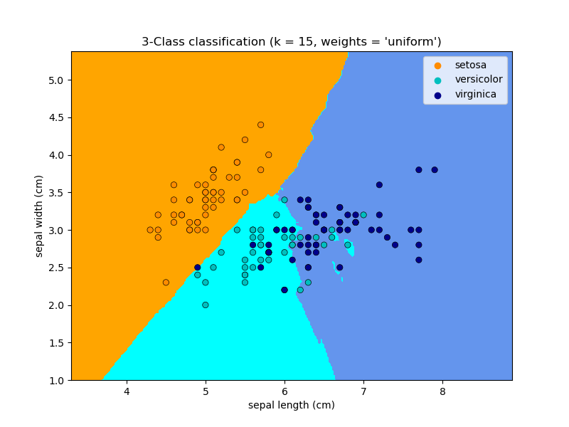
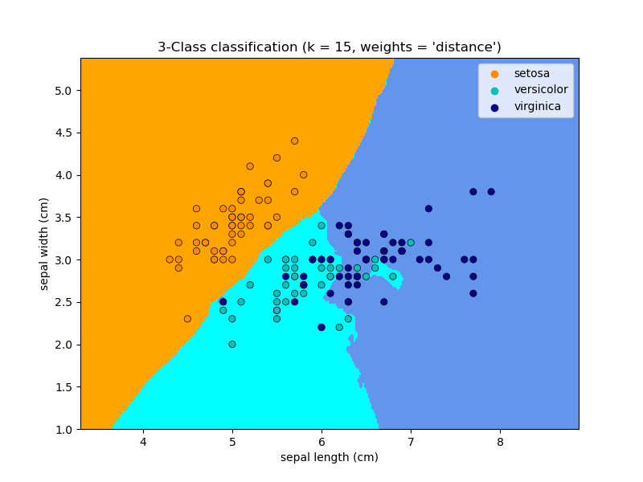

# KNN 
**K** **N**earest **N**eighbours: Classifying and regression aglorithm.

## Classification




KNN separates datapoints in regions and assigns those points labels (image: orange, blue and cyan colors). The axes of the plot represent features (image: we have only two features). When we add a new data point to the plot, KNN computes the distance between the new point and the `k` (in this case `k=15`) nearest points to it. If the mayority of the `k` nearest points has a certain label, KNN assigns that label to the new point.

A bigger `k` is useful for cases where we have a large number of data. On the other hand if we have a smaller data set, it is advisable to use a smaller number for `k`. It is also advised to take a odd number for `k` to facilitate the computation. 

In the image we have a second parameter, `weights`, which can have the values `uniform` or `distance`. `uniform` weight gives equal importance to every point, the `distance` weight gives higher importance to points which have a shorter distance to the new point. 

## Example

### Data
The data used for this example was the [Car Evaluation Data Set](https://archive.ics.uci.edu/ml/machine-learning-databases/car/) (car.data) of UCI Machine Learning Repositiory.

#### 1. Edit Data
In a first step we need to insert the names of the attributes manually since they are not inclueded in the dwonloaded file. So I inserted the line `buying,maint,doors,persons,lug_boot,safety,class` into the first line of the file.

#### 2. Choosing Features and Labels
In a second step I chose three attributes as my features and saved them in the variable `X`. As my label I chose the attribute `class` and saved it into the variable `y`.

#### 3. Converting strings into numbers
Now we have a problem: we have strings as data points but strings cannot be used by the algorthm, so I converted the strings into numbers. For X I chose the built in `LabelEncoder()` of sklearn and inserted the following block of code:

```python
Le = LabelEncoder()
for i in range(len(X[0])):
    X[:, i] = Le.fit_transform(X[:, i])
```

We can observe that `very high` is converted into 3 and `low` is converted into 1. 

For y I inserted:

```python
label_mapping = {
    'unacc': 0,
    'acc': 1,
    'good': 2,
    'vgood': 3
}
y['class'] = y['class'].map(label_mapping)
y = np.array(y)
```

This converts now 'unacc' into 0, 'acc' into 1, 'good' into 2, and 'vgood' into 3.

#### 4. Creating Model
First we need to set the variables `k` and `weights`.

```python
knn = neighbors.KNeighborsClassifier(n_neighbors=25, weights='uniform')
```
Now we have the KNN object, but we did not train the model, yet. Therefore we need to separate the data into training data and testing data, using

```python
X_train, X_test, y_train, y_test = train_test_split(X, y, test_size=0.2)
```

where the size of the testing data is 20%. Now we are able to train the model using

```python
knn.fit(X_train, y_train)
```

After training the model, we can test our data. Therefore we use

```python
prediction = knn.predict(X_test)
```

To measure the accuracy of the model, we use

```python
accuracy = metrics.accuracy_score(y_test, prediction)
```

In the end we have an accuracy of 0.7687861271676301.

