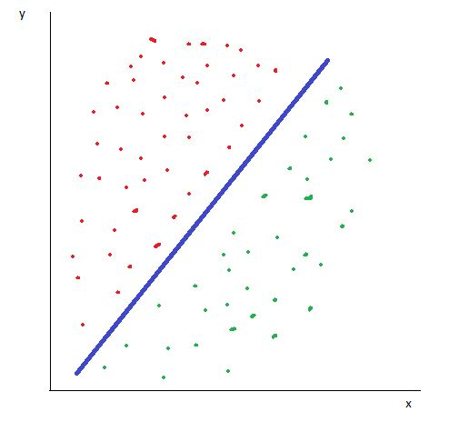
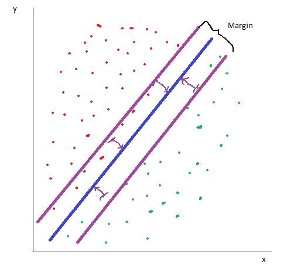
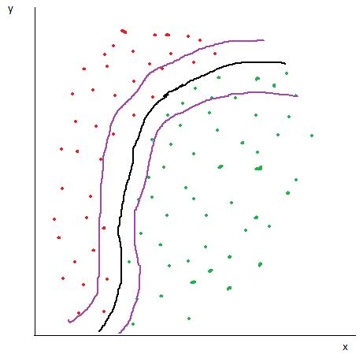

# SVM

**S**upport **V**ector **M**achine
- Effective high dimensional spaces
- Many kernel functions
- Classification and regression

## Functionality
After SVM received the data set, it separates the data points by creating a hyperplane (see Figure below). In the case of figure 1 where we have a two-dimensional plane, SVM creates a simple line. If we had a three-dimensional space, the hyperplane would be a two-dimensional plane. 



### Linear Kernel
In SVM, every data point is considered as a support vector. It computes the distances from the most critical support vectors (the ones which are the nearest to the hyperplane) to the hyperplane (the support vectors which are further away from the hyperplane are also considered, but they do not have an influence to the hyperplane). The distance of the nearest support vectors to the hyperplane is maximized (the so called functional margin) by the SVM algorithm, since in general the larger the margin, the lower the generalization error of the classifier.



### Non-Linear (Polynomial) Kernel
In case that the support vectors are not linearly seperable, they can also be separated polynomically. This method is very useful if we have overlapping data points, which can happen e.g. natually or by measurement errors.



## Example
For the example the [iris dataset](https://archive.ics.uci.edu/ml/datasets/iris) was used. The number of its attributes is 4, the number of instances is 150. Based on the attribute information (sepal length, sepal width, petal length, and petal width) we want to find out the class (Iris Setosa, Iris Versicolour, or Iris Virginica) of a testing object.

### 1. Edit Data
The same data like in the tutorial is used. To identify the classes I created an array containing the class names mentioned above. 

### 2. Create the Model
Import the model by using `from sklearn import svm`. After the train_test_split section, create the model by using `model = svm.SVC()` and train the model by using `model.fit(X_train, y_train)`.

### 3. Make the Predictions
Import the accuracy score by using `from sklearn.metrics import accuracy_score`, then make predictions using `predictions = model.predict(X_test)` and the accuracy score by using `acc = accuracy_score(y_test, predictions)`

### 4. Results
This delivers us an accuracy of 90%. Following the arrays compared (predictions, actual)
```
[1 1 0 2 0 1 1 1 1 0 0 0 2 0 2 1 1 1 2 2 2 2 0 2 1 2 0 0 1 2] <- predictions
[1 1 0 2 0 1 1 1 1 0 0 0 2 0 2 1 2 2 2 2 2 2 0 2 1 2 0 0 2 2] <- actual
                                   !                     !
```
