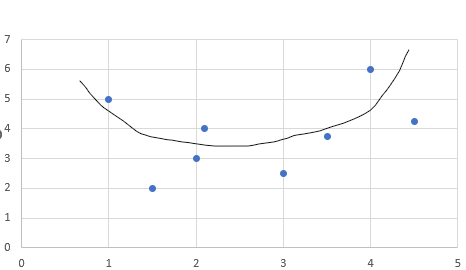
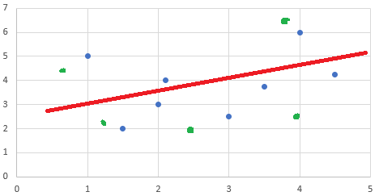
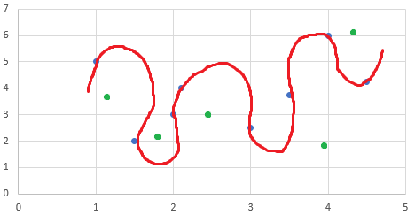

# Underfitting and Overfitting #
The goal of training a model is that the model can perform on data that we did not train the model on, the testing data.

Let us have a look at the following graph:

The black curve is the perfect fit that we want our model to come up with.

The perfect fit has the following attributes:

- low variance on both , the training data points and the testing data points
- small cost function on both , the training data points and the testing data points

## Underfitting ##
In the case of underfitting we have a model that is underfit due to reasons as:

- low training set (not enough data to train the model)
- we did not train the model enough
- we chose the wrong kind of activation function

In this case the line that the model could come up with is the following:

The green points in the graph are our testing data points. We see that we have a high variance in both, the testing points and the training points. 
This means that the data cannot be predicted properly, which again means that our model is too simple.

## Overfitting ##
In the cease of overfitting we have a model that is overfit due to reasosns as:

- high training data set (too much data to train the model)
- we trained the model too much
- we chose the wrong kind of activation function

In this case the line that the model could come up with is the following:

The green points in the graph signify our testing data points. We can see that we have a high variance in the testing data points, but a very low variance in our training data points.
This means that the data cannot be predicted properly, which again means that our model is too complicated.