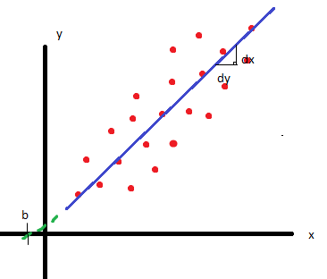
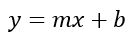
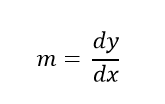
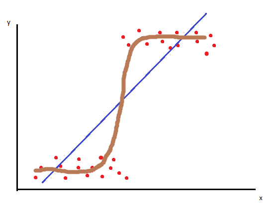
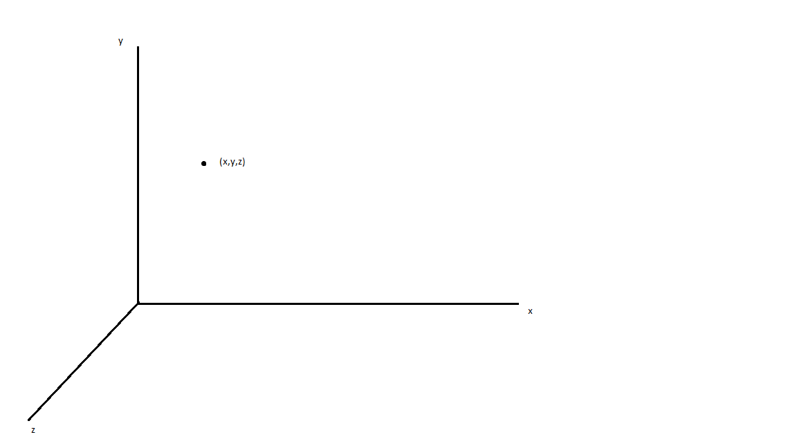
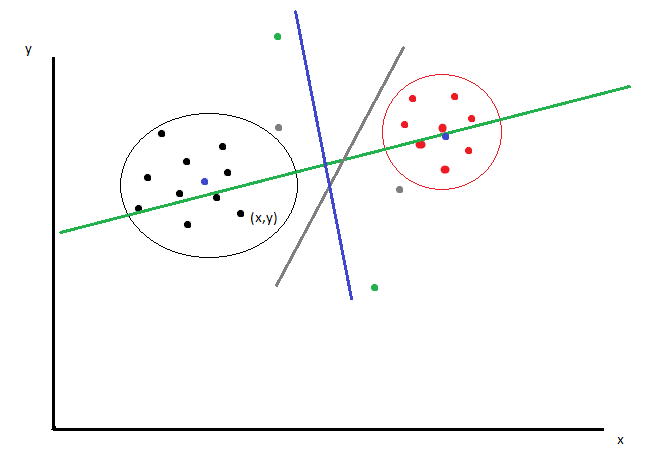
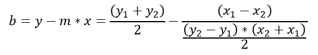

# Linear Regression vs. Logistic Regression

## Linear regression

In the graph above we can see scattered points (red) where we can add a regrssion line (blue). The R^2 value of the regression line indicates how accurate the line represents the data points. If the data points are far away from the line the R^2 value is small, if the data points are close to the line the R^2 value is big. The equation for the regression line is as follows:

b: interception of the regression line and the y-axis
m: the change in y over the change in x (slope)

If we want to fetch a point, we take the x-coordinates (labels) of that point and plug into the function, this will give us the y coordinate. This gives us the extrapolation of the linear regression (i.e. the extension of the line)^.

## Logistic regression

In the graph above we can again see scattered points (red), but this time they build two separate groups. A regression line (blue) would not be very accurate, even insignificant and no useful. This is where logistic regression comes in: imagine a function `logit()` (brown):

## KMeans and the Math Behind

Reminder: 2D-Graph means that we have two features. A data point has a x-coordinate and a y-coordinate, which are the two features.

A 3D-graph would have an extra coordinate ind every point and equivalent to that it would have three features.

In the graph above we can see two different groups (black and red) of data points which differ in color and location, which means we have two labels. Clustering means that we have an algorithm that separates the two groups in one group with the black label and another group with the red label. One type of clustering algorithm is K-Means. K-Means uses centroids corresponding to the two label, which in the beginning will be generated at random positions (green points). In the next step, a plane (hyperplane) is drawn/ computed (green line), where the two centroids have the equal distance to the line. In the next step, the average position of all the points in the region of the centroid is computed (average of the x-coordinates and average of the y-coordinates). For the upper centroid, all the points of the upper side of the plane are used and equivalent to that for the lower centroid all the points under the plane are taken. This gives us average points (grey) which are the new centroids. Again a new plane is computed (grey line). This procedure will be repeated until the convergence-value (blue centroids and blue line) is reached and the data points can be separated into two labels (black and red).

The equation of the hyperplane is as follows (given we have one centroid (x1,y1) and another one (x2,y2)):

